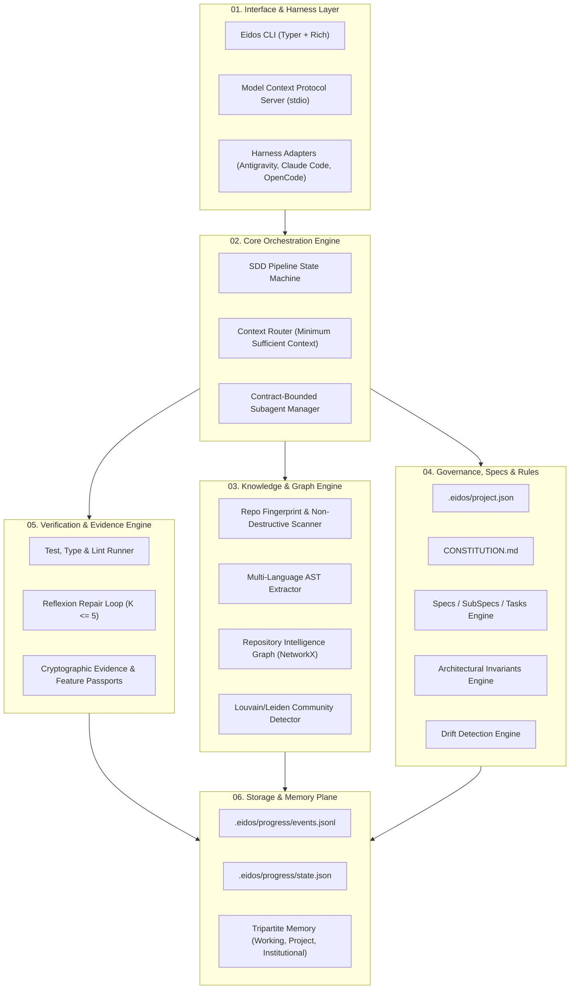

# ARCHITECTURE.md — Eidos System Architecture & Locked Contracts

**Project:** Eidos — Engineering Intelligence for Deterministic, Orchestrated Software  
**Version:** 1.0.0-LOCKED  
**Date:** September 2024 (Updated 2026)  
**Author:** Juan Bernardo Ordóñez & AI Agent Systems Research Team  
**Status:** ARCHITECTURE LOCK (Phase 2 Ratified)  

---

## 1. System Identity & Mission

Eidos is an open-source, portable **Agentic Software Engineering Layer**. It does not replace foundation models or coding agent harnesses; it provides the deterministic engineering intelligence that bridges them:
- **Project Discovery & State Fingerprinting**
- **Adaptive Requirements Interview**
- **Specification-Driven Development (SDD)**
- **Repository Intelligence Graph (AST + Communities)**
- **Context Routing (Minimum Sufficient Context)**
- **Contract-Bounded Fresh Subagents**
- **Multi-Harness Adapters (Antigravity, Claude Code, OpenCode, Codex)**
- **Verification-First Execution & Bounded Reflexion**
- **Cryptographic Evidence Anchoring & Feature Passports**
- **Event-Sourced Progress Logging**
- **Tripartite Isolated Memory**
- **Architectural Invariants & Drift Detection**
- **Controlled, Audited Self-Improvement**

---

## 2. Axiom 0: Self-Referential Development

> **Eidos must be the first system constructed using its own principles.**  
> Google Antigravity acts as the initial development harness. Every phase of Eidos follows:  
> `Research` $\rightarrow$ `Evidence` $\rightarrow$ `Architecture` $\rightarrow$ `ADR` $\rightarrow$ `Contracts` $\rightarrow$ `Specs` $\rightarrow$ `Skills` $\rightarrow$ `Implementation` $\rightarrow$ `Testing` $\rightarrow$ `Verification` $\rightarrow$ `Convergence`.

---

## 3. Structural Decomposition

---

## 4. Locked Component Contracts

### 4.1 CLI Entrypoint Suite (`eidos`)
- `eidos init`: Greenfield wizard or existing repository fingerprinting.
- `eidos doctor`: 14-point diagnostic verification of harness, graph, rules, and tests.
- `eidos analyze`: Non-destructive AST parsing, dependency mapping, and dead code detection.
- `eidos graph`: Build, cluster, query, and visualize the Repository Intelligence Graph.
- `eidos spec`: Scaffolding, planning, task decomposition, and schema checking.
- `eidos verify`: Multi-layer verification runner (tests, types, linter, invariants, drift).
- `eidos baseline`: Repository state snapshot and comparative delta audit.
- `eidos invariant`: Machine-checkable architectural invariant management.

### 4.2 Core State Machine
The lifecycle of any engineering task $\mathcal{T}$ is strictly defined by the finite state machine:
$$\text{DISCOVERY} \longrightarrow \text{SPECIFY} \longrightarrow \text{PLAN} \longrightarrow \text{IMPLEMENT} \longrightarrow \text{VERIFY} \longrightarrow \text{CONVERGE}$$
- Any verification failure transitions to `REPAIR`, ingesting compiler and test traces (Reflexion model).
- The loop is bounded at $K \le 5$ attempts; failure to converge triggers state `ESCALATED`.
- State `DONE` requires:
  $$\text{DONE} \iff \text{VerificationResult}(\text{tests}=\text{PASS}, \text{lint}=\text{PASS}, \text{types}=\text{PASS}, \text{invariants}=\text{PASS}) = \text{TRUE}$$

### 4.3 Repository Intelligence Graph
- **Node Taxonomy**: `File`, `Module`, `Class`, `Function`, `API`, `Database`, `Dependency`, `Test`, `Spec`, `SubSpec`, `Task`, `Agent`, `Skill`, `Rule`, `Finding`.
- **Edge Taxonomy**: `IMPLEMENTS`, `DEPENDS_ON`, `TESTED_BY`, `DOCUMENTED_BY`, `DEFINED_BY`, `MODIFIED_BY`, `VIOLATES`, `SATISFIES`, `DERIVED_FROM`, `CONFLICTS_WITH`, `SUPERSEDES`.
- **Epistemic Classification**:
  - `EXTRACTED` (Deterministic compiler fact, confidence = 1.0).
  - `INFERRED` (Semantic model hypothesis, confidence $\in [0.0, 0.99]$).
  - `USER_CONFIRMED` (Explicitly verified by human engineer).
  - `AGENT_PROPOSED` (Active task hypothesis).

### 4.4 Context Routing & Fresh Subagents
- **Minimum Sufficient Context (MSC)**: Injects only the $k \le 2$ neighborhood around target nodes, pruning function bodies to interface signatures to mitigate *Lost-in-the-Middle* degradation.
- **Contract-Bounded Fresh Subagents**: Subagents receive an isolated, immutable `AgentContract` JSON payload. Zero conversational history is transferred from parent sessions.

### 4.5 Security Architecture
- **Skill Security Gateway**: Static AST analysis + YARA scanning + author provenance check (Risk Score $< 25$).
- **Process & Filesystem Sandboxing**: Operating system policy-as-physics enforcement (Linux Landlock / namespaces) confining agent actions strictly to the project workspace.

---

## 5. Architectural Decision Records Index
- [ADR-001: Core Runtime & Polyglot Distribution Model](file:///home/juxnbernxrdo/Documentos/eidos/docs/adr/ADR-001-core-runtime-python.md)
- [ADR-002: Specification-Driven Development (SDD) & Verification-First State Machine](file:///home/juxnbernxrdo/Documentos/eidos/docs/adr/ADR-002-specification-driven-verification-first.md)
- [ADR-003: Repository Intelligence Graph Architecture & Epistemic Classification](file:///home/juxnbernxrdo/Documentos/eidos/docs/adr/ADR-003-repository-graph-ast-networkx.md)
- [ADR-004: Contract-Bounded Fresh Subagents & Context Isolation](file:///home/juxnbernxrdo/Documentos/eidos/docs/adr/ADR-004-contract-bounded-subagents.md)
- [ADR-005: Tripartite Memory Architecture & Cross-Project Isolation](file:///home/juxnbernxrdo/Documentos/eidos/docs/adr/ADR-005-tripartite-memory-isolation.md)
- [ADR-006: Portable Harness Adapter Abstraction Layer](file:///home/juxnbernxrdo/Documentos/eidos/docs/adr/ADR-006-harness-adapter-abstraction.md)
- [ADR-007: Multi-Layer Security Architecture (SkillSpector/OpenShell)](file:///home/juxnbernxrdo/Documentos/eidos/docs/adr/ADR-007-security-sandbox-openshell-skillspector.md)
- [ADR-008: Event-Sourced Progress Log & Cryptographic Evidence Anchoring](file:///home/juxnbernxrdo/Documentos/eidos/docs/adr/ADR-008-event-sourcing-progress-evidence.md)
