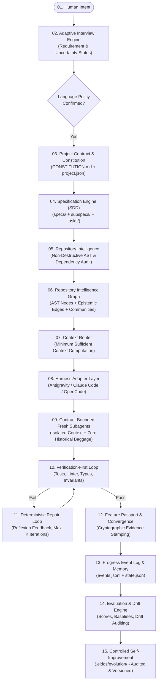
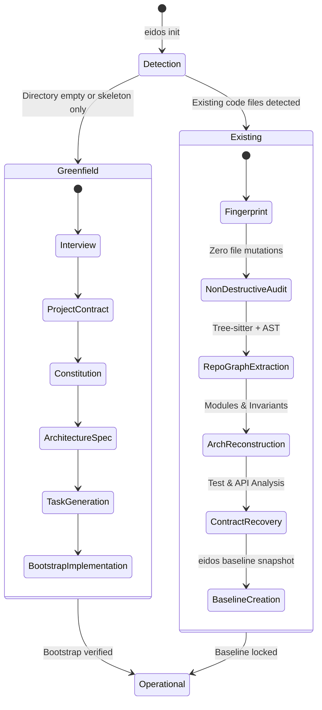
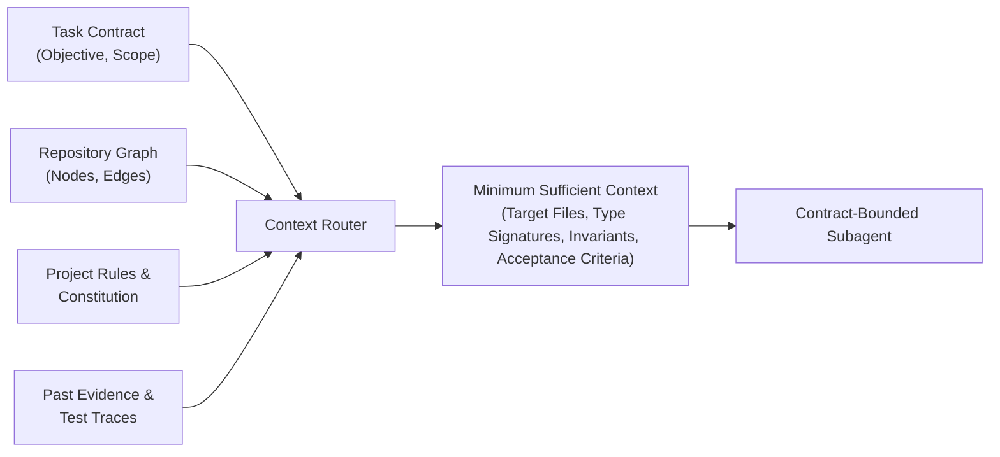
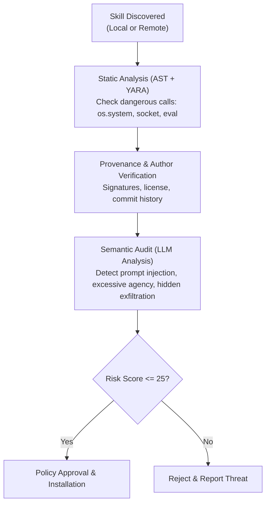
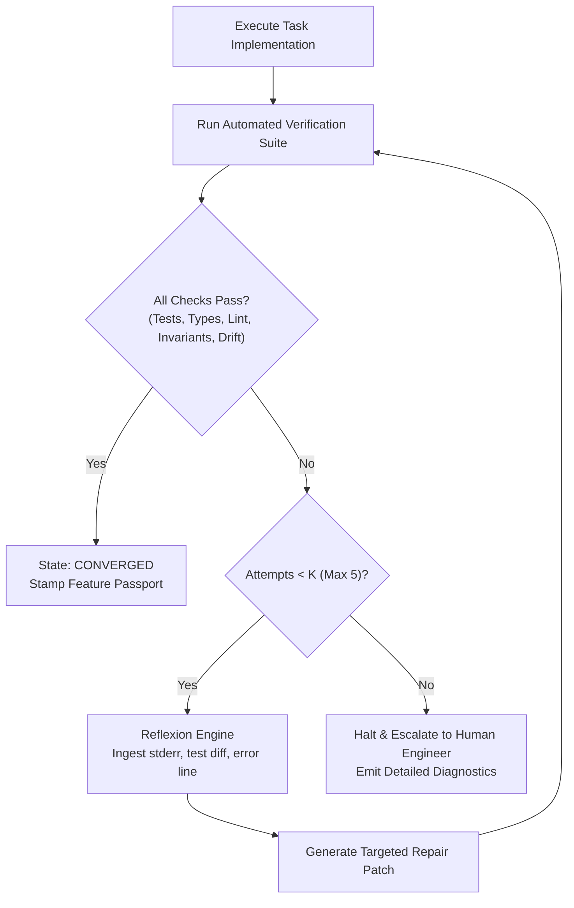

# EIDOS Comprehensive Architecture Proposal

**Project:** Eidos — Engineering Intelligence for Deterministic, Orchestrated Software  
**Version:** 1.0.0-PROPOSAL  
**Author:** Juan Bernardo Ordóñez & AI Agent Systems Research Team  
**Status:** Approved for Phase 2 Architecture Lock  

---

## 1. System Vision & Foundational Axiom

Eidos is an open-source, portable **Agentic Software Engineering Layer** designed to bridge the chasm between raw foundation models and real-world software codebases. Eidos is **not** a full standalone coding agent; it is the structural, deterministic engineering harness that provides repository intelligence, specification governance, context routing, invariant verification, and cryptographic auditability across existing agent harnesses (Google Antigravity, Claude Code, OpenCode, Codex, Cursor, and Hermes Agent).

### The Self-Referential Imperative
> **Axiom 0:** Eidos must be the first system constructed using its own methodology. Antigravity operates as the initial harness upon which Eidos principles are applied. No architectural construct will be accepted for Eidos that Eidos cannot apply to itself.

---

## 2. End-to-End Conceptual Pipeline



---

## 3. Greenfield vs. Existing Repository State Machine

Eidos automatically detects the repository lifecycle state upon running `eidos init`:



### 3.1 Greenfield Protocol
If the target workspace is empty:
1. `eidos init` triggers the **Adaptive Interview Engine**.
2. Establishes the **Language Policy**, **Project Contract**, and **Constitution**.
3. Generates the initial **System Architecture Spec** and foundational tasks.
4. Initializes the pristine `.eidos/` governance directory.

### 3.2 Existing Repository Protocol (Non-Destructive Audit)
If existing source code is detected, Eidos strictly operates in **Read-Only / Non-Destructive Mode**:
1. **Fingerprint**: Computes language distribution, framework signatures, dependency lockfiles, test runners, and Git commit history.
2. **AST & Call Graph Extraction**: Parses syntax trees to map classes, functions, and cross-module imports.
3. **Architecture & Contract Reconstruction**: Identifies implicit architectural boundaries, public APIs, database models, and existing unit tests.
4. **Vulnerability & Drift Audit**: Flags dead code, circular dependencies, unmaintained dependencies, missing tests, and contract violations.
5. **Baseline Snapshot**: Generates `.eidos/baseline/initial_baseline.json` against which all subsequent Eidos-assisted modifications are empirically compared.

---

## 4. Adaptive Interview Engine & Language Policy

### 4.1 Requirement State and Uncertainty Minimization
Human intent begins as an under-specified natural language statement (e.g., *"Quiero construir una fintech"*). Asking an exhaustive 100-question questionnaire overwhelms the user; asking too few questions leads to architectural hallucination.

Eidos models the interview process as an information-theoretic **Entropy Reduction Machine**:
- **Requirement State ($\mathcal{R}$)**: A structured vector tracking established engineering parameters (domain, user scale, latency budget, auth model, database, deployment target, regulatory compliance).
- **Uncertainty State ($\mathcal{U} \in [0, 1]$)**: The normalized Shannon entropy over critical architectural decision dimensions:
  $$\mathcal{U} = -\sum_{i=1}^{N} p(d_i) \log_2 p(d_i)$$
- **Question Selection Policy**: In each round, Eidos selects the query that maximizes Expected Information Gain ($\Delta \mathcal{U}$).
- **Stopping Condition**: The interview halts automatically when $\mathcal{U} < \mathcal{U}_{\text{threshold}}$ (sufficient data exists to make unambiguous architectural decisions) or when the user requests an explicit transition to planning.

### 4.2 Language Policy Confirmation Protocol
During the interview, Eidos continuously detects the language utilized by the human developer. Before creating permanent repository artifacts, Eidos triggers an explicit confirmation:

```text
Detecté que la conversación se desarrolla en español.
¿Deseas establecer el español como idioma oficial de documentación para este proyecto?
[1] Sí, español como idioma documental oficial.
[2] No, utilizar inglés para toda la documentación técnica.
```

The selected preference is locked into `.eidos/project.json` as `documentation_language` and enforced by all subsequent subagents.

---

## 5. Governance & Documentation Router

Eidos adopts **Hierarchical Progressive Disclosure**. No single file contains the entire system specification. Context is partitioned into modular, navigable tiers.

```text
AGENTS.md                         <-- Level 0: Entry Point & Router for AI Harnesses
CONSTITUTION.md                   <-- Level 1: Stable Principles & Architectural Invariants
.eidos/
├── project.json                  <-- Machine-readable project contract & settings
├── rules/                        <-- Operational rules (coding standards, git policy)
│   ├── ARCH-001-layers.json
│   └── SEC-001-auth.json
├── architecture/                 <-- Living architectural blueprints & C4 diagrams
│   ├── overview.md
│   └── data-model.md
├── specs/                        <-- Specification-Driven Development artifacts
│   ├── spec.json (and spec.md)
│   ├── subspecs/
│   └── tasks/
├── decisions/                    <-- Architectural Decision Records (ADR-001...N)
├── security/                     <-- Security policies, threat models, scan results
├── testing/                      <-- Test strategy, verification commands, coverage
├── graph/                        <-- Repository Intelligence Graph & community data
│   ├── repository_graph.json
│   └── communities.json
├── evidence/                     <-- Cryptographic evidence anchors & findings
├── progress/                     <-- Event-sourced progress logs
│   ├── events.jsonl
│   └── state.json
├── memory/                       <-- Local project memory and sanitized institutional rules
├── baseline/                     <-- Serialized baseline snapshots & diff reports
└── evolution/                    <-- Audited self-improvement proposals & experiments
```

### 5.1 `AGENTS.md` (Level 0 Router)
Serves as the root navigation beacon for any agent entering the workspace. It contains zero bloated inline code; it provides an explicit index of pointers, informing the agent where to find rules, how to query the graph, which tools are permitted, and how to execute verification.

### 5.2 `CONSTITUTION.md` (Level 1 Principles)
Contains immutable, human-approved principles governing:
1. Architecture Invariants (e.g., Domain layer must never import Infrastructure).
2. Security Axioms (e.g., Zero plain-text secrets, mandatory input sanitization).
3. Verification Mandates (e.g., Zero commits without passing unit tests).
4. Dependency Policies (e.g., Only approved permissive open-source licenses).

---

## 6. Repository Intelligence & Repository Graph

### 6.1 Entity Ontology (Nodes)
The Eidos Graph represents repositories as heterogeneous directed graphs $\mathcal{G} = (\mathcal{V}, \mathcal{E})$ with 15 typed node classes:
`File`, `Module`, `Class`, `Function`, `API`, `Database`, `Dependency`, `Test`, `Spec`, `SubSpec`, `Task`, `Agent`, `Skill`, `Rule`, `Finding`.

### 6.2 Relational Taxonomy (Edges) & Epistemic Classification
Nodes are interconnected via 11 strictly typed relationships:
`IMPLEMENTS`, `DEPENDS_ON`, `TESTED_BY`, `DOCUMENTED_BY`, `DEFINED_BY`, `MODIFIED_BY`, `VIOLATES`, `SATISFIES`, `DERIVED_FROM`, `CONFLICTS_WITH`, `SUPERSEDES`.

Every edge is stamped with an **Epistemic Classification**:
- `EXTRACTED`: Parsed deterministically via Tree-sitter / compilers (Confidence = 1.0).
- `INFERRED`: Derived via LLM semantic interpretation (Confidence $\in [0.0, 0.99]$).
- `USER_CONFIRMED`: Inferred relationship explicitly verified by a human.
- `AGENT_PROPOSED`: Active working hypothesis pending verification.

### 6.3 Graph Intelligence Metrics
Eidos executes graph algorithms via `networkx`/`rustworkx`:
1. **Community Detection (Louvain / Leiden)**: Groups closely coupled files into architectural clusters; high inter-community edge densities flag architectural leaks.
2. **God Node Detection**: Computes degree and betweenness centrality to identify overly coupled classes/functions representing high-risk single points of failure.
3. **Cohesion Scoring ($Q \in [0, 1]$)**: Measures repository modularity to quantify architectural health over time.

---

## 7. Context Engineering & The Context Router

The goal of Context Engineering in Eidos is **not** to saturate the LLM's context window with thousands of tokens. The goal is to provide the **Minimum Sufficient Context (MSC)**.



### Minimum Sufficient Context (MSC) Algorithm
1. Given target `Task`, identify primary entity nodes in $\mathcal{G}$.
2. Perform bounded graph traversal ($k$-hop neighborhood, $k \le 2$) along `DEPENDS_ON`, `IMPLEMENTS`, and `TESTED_BY` edges.
3. Filter out implementation bodies of non-target nodes; retain only **Interface Signatures**, **Type Definitions**, and **Contract Comments**.
4. Retrieve active constitutional rules tagged with relevant entity types.
5. Pack context deterministically with critical contracts pinned at the prompt boundary (mitigating *Lost-in-the-Middle* degradation).

---

## 8. Contract-Bounded Fresh Subagents

Eidos abolishes long-lived, rambling conversational singletons. Subagents are initialized as **ephemeral, isolated execution units** bound by an immutable contract:

```json
{
  "$schema": "https://eidos.dev/schemas/agent_contract.json",
  "task_id": "TASK-104",
  "spec_id": "SPEC-012",
  "objective": "Add rate-limiting middleware to payment endpoints",
  "target_files": ["src/api/middleware/rate_limit.py"],
  "allowed_tools": ["view_file", "replace_file_content", "run_test"],
  "constraints": [
    "No external Redis dependency; use in-memory token bucket",
    "Must satisfy ARCH-002 (middleware independence)"
  ],
  "acceptance_criteria": [
    "Unit tests pass with >90% branch coverage",
    "Lint and type checking return 0 errors"
  ]
}
```

Subagents execute their assigned task, run local verification, emit structured findings, and terminate. Zero chat history is transferred between tasks.

---

## 9. Skill Ecosystem, Provenance & Security Gateway

### 9.1 Skill Directory Structure
Eidos adopts the open `SKILL.md` standard compatible with Anthropic and Antigravity, extended with formal validation metadata:
```text
skills/<skill_name>/
├── SKILL.md            <-- Frontmatter metadata and procedural instructions
├── skill.json          <-- Machine-readable manifest (dependencies, permissions)
├── schema.json         <-- Tool parameter and output validation schema
├── scripts/            <-- Executable scripts (Python / Bash)
├── references/         <-- Domain documentation and specifications
├── examples/           <-- Concrete few-shot exemplars
├── tests/              <-- Unit tests validating skill execution
└── provenance.json     <-- Origin, commit hash, author signature, audit report
```

### 9.2 The "Find-Skills" Reuse Policy
Before writing a new skill, Eidos enforces a strict reuse evaluation:
1. Search local `.agents/skills` and the open registry via `find-skills` / `skills.sh`.
2. Inspect candidate skills: install count ($> 1,000$), source reputation, GitHub stars ($> 100$), maintenance freshness.
3. Audit license compatibility (MIT, Apache 2.0, BSD).
4. Run the **Skill Security Gateway**. Only if no acceptable skill exists will Eidos scaffold a new, project-specific skill.

### 9.3 Skill Security Gateway (SkillSpector + OpenShell Model)


---

## 10. Portable Harness Adapter Architecture

Eidos isolates host-specific communication behind an abstract interface:

```python
class HarnessAdapter(ABC):
    @abstractmethod
    def detect(self, workspace_root: str) -> bool: ...
    @abstractmethod
    def capabilities(self) -> Dict[str, bool]: ...
    @abstractmethod
    def configure(self, project_contract: Dict[str, Any]) -> None: ...
    @abstractmethod
    def dispatch_subagent(self, task_contract: Dict[str, Any]) -> str: ...
    @abstractmethod
    def collect_execution_trace(self, execution_id: str) -> Dict[str, Any]: ...
```

### First-Class Harness Implementations
- `AntigravityAdapter`: Interacts natively with Google Antigravity (mounts `.agents/skills`, registers subagents via `define_subagent`/`invoke_subagent`, generates rich artifacts in brain directory).
- `ClaudeCodeAdapter`: Generates `.claude/skills/`, writes `CLAUDE.md`, configures MCP stdio servers.
- `OpenCodeAdapter`: Mounts `AGENTS.md` and coordinates with LSP servers.
- `HeadlessAdapter`: Pure CLI/Docker container runner for SWE-bench benchmarking and CI/CD automation.

---

## 11. Verification-First & The Closed-Loop Repair Paradigm

In Eidos, code is never committed simply because an LLM claims it has completed the work. The system enforces a deterministic verification loop:



### Verification Criteria
A task achieves `CONVERGED` if and only if:
1. **Unit & Integration Tests**: 100% pass on targeted and regression test suites.
2. **Static Typing**: Type checker (`pyright` / `mypy` / `tsc`) reports 0 errors.
3. **Linter & Code Standards**: Linter (`ruff` / `eslint`) reports 0 violations.
4. **Architectural Invariants**: `eidos invariant check` passes without violations.
5. **Contract Consistency**: Zero broken interfaces or documentation drift detected.

---

## 12. Feature Passport & Traceability

Every engineering feature or bugfix produces an immutable **Feature Passport**:
```text
Feature Passport: FEAT-204
├── Requirement Anchor: REQ-089 ("Implement secure OAuth2 callback")
├── Specification: SPEC-014 (docs/specs/oauth_callback.md)
├── Architecture Node: auth.oauth.CallbackHandler
├── Dependencies: ["authlib>=1.3.0"]
├── Implementation Diff: git commit 4f9e12a (3 files changed, +84, -12)
├── Test Suite: tests/test_oauth_callback.py (8 passed, 0 failed, 94% coverage)
├── Security Audit: SkillSpector clean, 0 static vulnerabilities
├── Architectural Invariants: ARCH-001 PASS, ARCH-004 PASS
├── Cryptographic Evidence: EVID-8812, EVID-8813
└── Final Verification Status: CONVERGED (2 iterations)
```

---

## 13. Event-Sourced Progress & Tripartite Memory

### 13.1 Event-Sourced Progress Stream
All actions, tool invocations, verification runs, and decisions append to `.eidos/progress/events.jsonl`. Project state at any point in time is computed via:
$$\mathcal{S}_t = \text{Fold}(\text{InitialState}, [e_1, e_2, \dots, e_t])$$

### 13.2 Tripartite Memory
1. **Working Memory**: In-memory task state; destroyed upon subagent termination.
2. **Project Memory**: Checked into Git under `.eidos/`; includes specs, ADRs, graph, and progress logs.
3. **Institutional Memory**: Resides in `~/.eidos/institutional/`; contains sanitized, generalized engineering heuristics scrubbed of proprietary code and approved by a human engineer.

---

## 14. Architectural Invariants & Drift Detection Engine

### 14.1 Architectural Invariants
Defined in machine-readable YAML/JSON:
```yaml
id: ARCH-001
name: strict-layer-isolation
description: Domain layer must not depend on Infrastructure or Presentation
rule:
  layer: domain
  forbidden_imports:
    - infrastructure
    - presentation
    - api
```
Verified deterministically by `eidos invariant check` through static AST inspection.

### 14.2 Drift Detection Engine
Eidos continuously audits the repository for divergence:
- `DOC-DRIFT`: Source code modified without corresponding updates to technical documentation.
- `SPEC-DRIFT`: Code implementation diverges from the accepted specification.
- `ARCH-DRIFT`: Module dependencies violate the baseline architecture graph.
- `CONTRACT-DRIFT`: Public API response schema changes without updating API contracts.

---

## 15. Eidos Diagnostic Suite: Doctor & Baseline

### 15.1 `eidos doctor`
Performs an instant 14-point pre-flight diagnostic check:
1. Harness availability and capabilities.
2. `AGENTS.md` and `CONSTITUTION.md` presence and schema validity.
3. Repository Intelligence Graph freshness.
4. Active skill integrity and security clearance.
5. Invariant engine readiness.
6. Git working tree cleanliness and worktree isolation.
7. Test runner accessibility.

### 15.2 `eidos baseline`
Takes a cryptographic, versioned snapshot of the repository state:
```bash
eidos baseline create --tag v1.0-pre-refactor
eidos baseline compare --against v1.0-pre-refactor
```
Outputs an objective delta across test pass rates, architectural coupling, dead code, and documentation coverage.

---

## 16. Evidence-Based Scoring System

Eidos rejects subjective, hallucinated LLM scorecards. Every score is computed using **Observed Metrics**:

$$\text{Health Score} = w_1 \cdot \mathcal{S}_{\text{arch}} + w_2 \cdot \mathcal{S}_{\text{sec}} + w_3 \cdot \mathcal{S}_{\text{test}} + w_4 \cdot \mathcal{S}_{\text{spec}} + w_5 \cdot \mathcal{S}_{\text{drift}}$$

| Dimension | Calculation Method | Evidence Anchor |
|:---|:---|:---|
| **Architecture Health ($\mathcal{S}_{\text{arch}}$)** | Graph Modularity ($Q$) minus Invariant Violations count. | NetworkX Louvain + `eidos invariant` |
| **Security ($\mathcal{S}_{\text{sec}}$)** | $100 - \sum \text{CVE/SAST Severity Weights}$. | SkillSpector + Bandit/Semgrep |
| **Testing ($\mathcal{S}_{\text{test}}$)** | $\text{Statement Coverage} \times \text{Pass Rate}$. | Pytest / Jest Coverage Reports |
| **Spec Coverage ($\mathcal{S}_{\text{spec}}$)** | Percentage of implemented functions mapped to active specs. | Repo Graph `IMPLEMENTS` edges |
| **Documentation Drift ($\mathcal{S}_{\text{drift}}$)** | $100 - (\text{Drift Count} \times 10)$. | Eidos Drift Detection Engine |

---

## 17. Evaluation Model & Ablation Protocol

To scientifically validate the Eidos layer, the evaluation infrastructure executes controlled ablation experiments against standard benchmarks (SWE-bench Verified, CrossCodeEval):

```text
Ablation Configurations:
[C0] Baseline Harness (Raw Model + Raw Bash)
[C1] C0 + Specifications (SDD)
[C2] C1 + Repository Graph Context Routing
[C3] C2 + Contract-Bounded Fresh Subagents
[C4] C3 + Verification-First Loop (Eidos Full Stack)
```
Metrics tracked: Verified Success Rate, Regression Rate, Tokens per Task, Tool Thrashing Index, Cost per Task.

---

## 18. Self-Referential Development Protocol for Eidos

Building Eidos must strictly follow the Eidos lifecycle:
1. **Research & Evidence**: Documented in `docs/research/`.
2. **Architecture & ADRs**: Locked in `docs/architecture/` and `docs/adr/`.
3. **Schemas**: Formalized in `docs/architecture/SCHEMAS_SPECIFICATION.md`.
4. **Bootstrap Phase**: Implement minimal viable core (`init`, `doctor`, `graph`, `spec`, `verify`).
5. **Self-Hosting Loop**: Use Eidos commands inside Antigravity to analyze, specify, implement, and verify subsequent Eidos components.
