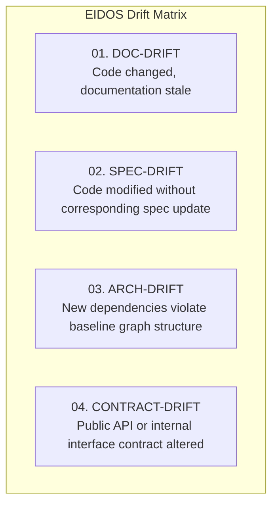
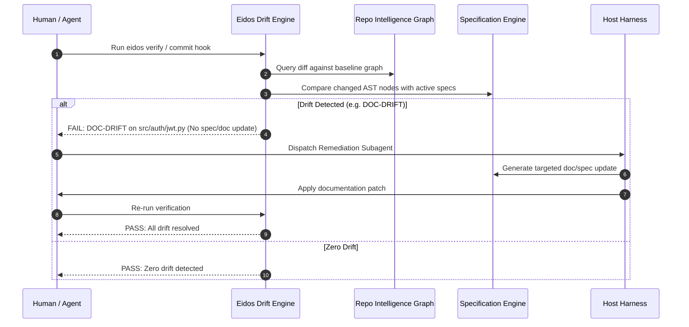

# EIDOS Invariants & Drift Detection Engine Specification

**Project:** Eidos — Engineering Intelligence for Deterministic, Orchestrated Software  
**Version:** 1.0.0  
**Domain:** Deterministic Architectural Enforcement & Drift Prevention  

---

## 1. Architectural Invariants Engine

### 1.1 Concept
An **Architectural Invariant** is an explicit, machine-checkable assertion regarding structural, dependency, or contractual boundaries within the codebase. Unlike linters that check syntax or formatting, invariants verify systemic boundaries (e.g., Clean Architecture layer isolation, dependency flow, banned APIs, circular dependencies).

### 1.2 Invariant Schema (`invariant.schema.json`)
```yaml
id: ARCH-001
name: clean-architecture-layers
description: Domain entity layer must never import infrastructure, database, or presentation
severity: CRITICAL
enforcement: BLOCKING

rule:
  scope:
    directory: "src/domain/"
  forbidden_imports:
    - "src.infrastructure"
    - "src.presentation"
    - "src.api"
    - "sqlalchemy"
    - "django.db"
    - "requests"
```

### 1.3 Invariant Types
1. **Import Isolation Invariants**: Enforces directional dependency rules (e.g., `domain` $\leftarrow$ `application` $\leftarrow$ `infrastructure`).
2. **Circular Dependency Invariants**: Enforces that the repository dependency graph is a Directed Acyclic Graph (DAG) with zero cycles.
3. **Encapsulation Invariants**: Prevents direct instantiation of internal module classes from external packages.
4. **Security Invariants**: Forbids insecure system calls (`eval`, `exec`, `os.system`) outside of designated, sandboxed modules.
5. **Contract Invariants**: Mandates that public API handlers implement declared Pydantic/OpenAPI response schemas.

### 1.4 CLI Interface
```bash
# List all registered architectural invariants
eidos invariant list

# Verify all invariants against the current AST graph
eidos invariant check

# Check a specific invariant rule
eidos invariant check ARCH-001

# Scaffold and register a new invariant rule
eidos invariant add --name "no-raw-sql" --scope "src/services" --forbidden "raw_sql"
```

---

## 2. Multi-Dimensional Drift Detection Engine

### 2.1 The Four Classes of Drift



### 2.2 Drift Definitions & Detection Mechanisms

| Drift Class | Detection Trigger | Mathematical / Algorithmic Check | Severity | Remediation Strategy |
|:---|:---|:---|:---|:---|
| **`DOC-DRIFT`** | Code files modified in Git commit without corresponding documentation file modifications. | Let $\Delta_{\text{code}}$ be modified source files. For each $f \in \Delta_{\text{code}}$, verify that $\exists \, d \in \text{Docs}$ where $(f, \text{DOCUMENTED\_BY}, d) \in \mathcal{E}$ and $d \in \Delta_{\text{docs}}$. If false, flag `DOC-DRIFT`. | Medium | Subagent dispatched to generate updated Markdown documentation matching the new code. |
| **`SPEC-DRIFT`** | Function or class signatures added or modified that do not map to an active approved `Task` or `SubSpec`. | Traverse $\mathcal{G}$ to check if new AST nodes are reachable via `IMPLEMENTS` edges from the active `Spec`. Unlinked nodes flag `SPEC-DRIFT`. | High | Either roll back unauthorized code or update/re-approve the specification. |
| **`ARCH-DRIFT`** | Graph density or community coupling exceeds the baseline snapshot ($Q_{\text{current}} < Q_{\text{baseline}} - \epsilon$). | Modularity comparison: $\Delta Q = Q(G_{\text{current}}) - Q(G_{\text{baseline}})$. If $\Delta Q < -0.05$, alert on architectural degradation. | High | Flag cross-boundary imports and suggest decoupling via dependency injection. |
| **`CONTRACT-DRIFT`**| Public API endpoint return signature or parameter type changes without an updated contract test. | Static type comparison between exported interface schema and existing test assertions. | Critical | Fail verification; require explicit API versioning or contract test updates. |

---

## 3. Drift Resolution Workflow


