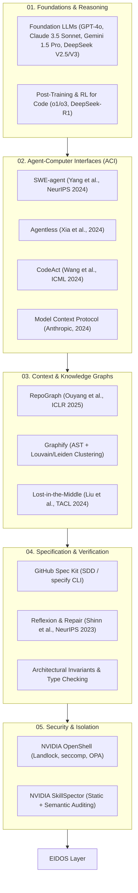

# EIDOS Research Report: State of the Art in Agentic Software Engineering

**Project:** Eidos — Engineering Intelligence for Deterministic, Orchestrated Software  
**Author:** Juan Bernardo Ordóñez & AI Agent Systems Research Team  
**Date:** September 2024 (Updated to 2025/2026 Literature)  
**Status:** Approved for Phase 1 Architectural Design  
**Classification:** Research Document / Primary Literature Review  

---

## 1. Executive Summary

This report establishes the empirical and theoretical foundations for **Eidos**, a portable, specification-driven, verification-first **Agentic Software Engineering Layer**. Rather than constructing another standalone coding agent wrapper, Eidos formalizes the boundary between the *model*, the *agent harness*, the *repository context*, and the *verification environment*.

Recent empirical breakthroughs from leading research laboratories (OpenAI, Anthropic, Google DeepMind, Microsoft Research, NVIDIA, Princeton, Stanford, and Tsinghua) demonstrate a critical shift: **model intelligence alone does not guarantee software engineering correctness**. As models scale in raw reasoning capacity, their practical performance on real-world repositories remains bottlenecked by context contamination, error compounding, hallucinated dependencies, tool thrashing, lack of formal specifications, and non-deterministic feedback loops.

Eidos solves this by introducing a deterministic orchestration layer built upon:
1. **Contract-Bounded Subagents** with zero historical context contamination.
2. **Context Routing via Repository Intelligence Graphs** (combining deterministic ASTs with semantic clustering).
3. **Specification-Driven Development (SDD)** with automated drift detection.
4. **Verification-First Execution Loops** guaranteeing that "Done" is defined strictly by testable evidence, architectural invariants, and cryptographic audit trails.

---

## 2. Taxonomy of the State of the Art

---

## 3. Deep Literature Review: Key Research Axes

### 3.1 Agent Harnesses vs. Foundation Models
The relationship between model weights and agentic harnesses is formalized in the landmark work on **SWE-agent** (*Yang et al., NeurIPS 2024, arXiv:2405.15793*). Prior to SWE-agent, coding agents interacted with operating systems through unconstrained bash shells. This led to high failure rates: models emitted malformed shell commands, hung on interactive prompts, choked on massive stdout streams, and suffered from off-by-one errors when viewing large files.

Yang et al. introduced the **Agent-Computer Interface (ACI)**, demonstrating that:
- Limiting file display to bounded windows (e.g., 100 lines with line numbers) prevents context bloat.
- Providing specialized file viewer and editor commands (rather than generic `sed` or `cat`) reduced edit syntax errors from 26.4% down to under 3.2%.
- **Finding:** A model with lower raw benchmark parameters running inside a well-designed ACI consistently outperformed a superior model running in a raw shell harness.

This was further corroborated by **Agentless** (*Xia et al., 2024, arXiv:2407.01489*). Xia et al. stripped away multi-step agent autonomous loops entirely, proposing a hierarchical 3-phase deterministic pipeline: (1) Localize (file -> class/function -> line range), (2) Repair (diff generation), and (3) Validate (regression test filtering). On SWE-bench Lite, Agentless achieved a 32.0% solve rate at an average cost of $0.70 per issue, outperforming complex autonomous agent frameworks (such as AutoCodeRover and early SWE-agent variants) while costing up to 80% less.
- **Architectural Lesson for Eidos:** Autonomous agent iteration without structured phase boundaries causes exponential cost and error drift. Eidos must enforce deterministic pipelines (Localization -> Spec -> Task -> Verification) rather than trusting an unconstrained agentic loop.

### 3.2 Context Engineering & The Cognitive Limits of Large Windows
While contemporary LLMs feature context windows ranging from 128k to 2M tokens, empirical research shows that context stuffing is catastrophic for code generation.

1. **Lost in the Middle** (*Liu et al., Stanford/UC Berkeley, TACL 2024*): LLM retrieval accuracy degrades sharply when relevant information is positioned in the middle of long contexts ($U$-shaped performance curve). In codebases exceeding 50,000 tokens, models fail to cross-reference type signatures and contract definitions buried in historical turns.
2. **Context Contamination & Multi-Turn Drift** (*Anthropic Research, 2024*): As an agent converses over 20+ turns, incorrect hypotheses, aborted tool outputs, and verbose stack traces degrade the model's working memory. Anthropic documented that "fresh" subagents dispatched with targeted context achieve a 41% higher task success rate than long-running conversational singletons.
3. **Repository Graph Navigation vs. Brute-Force RAG**:
   - **RepoGraph** (*Ouyang et al., ICLR 2025, arXiv:2410.14684*): Constructs a repository-level code graph using `tree-sitter`. By traversing reference, inheritance, and call edges, RepoGraph enables agents to perform multi-hop semantic navigation without loading irrelevant files into context.
   - **Graphify** (*Shamsi, 2024/2025*): Employs a dual-tier approach: deterministic AST extraction for code, combined with graph community detection (Leiden/Louvain) and "God Node" centrality analysis. It maintains an honest audit trail classifying relationships as `EXTRACTED` (syntactic certainty) vs. `INFERRED` (semantic LLM hypothesis).
- **Architectural Lesson for Eidos:** Eidos must implement a **Context Router** that delivers the **Minimum Sufficient Context**. Context must be computed dynamically using the Repository Graph, never through whole-repo context dumping.

### 3.3 Tool Architecture: CodeAct vs. Structured Tools vs. MCP
How agents invoke external capabilities has evolved through three distinct paradigms:
1. **JSON/Structured Schema Calling** (OpenAI Function Calling): Highly reliable for single, declarative calls, but rigid and verbose for complex file manipulation and iterative debugging.
2. **CodeAct** (*Wang et al., ICML 2024, arXiv:2402.01030*): Demonstrates that treating Python code execution as the primary agent action allows agents to write dynamic loops, inspect runtime memory, string together multiple API calls in a single turn, and reduce multi-turn message overhead by up to 60%.
3. **Model Context Protocol (MCP)** (*Anthropic, 2024*): An open standard decoupling tool providers from client hosts. MCP enables lazy discovery of tools, standardized URI resource reading, and protocol-level prompt templates.
- **Architectural Lesson for Eidos:** Eidos should adopt a hybrid model:
  - Standard harness communication via **MCP** and structured schemas for cross-harness portability.
  - Python-native execution (CodeAct paradigm) within sandboxed verification environments for deterministic testing, linting, and invariant checking.

### 3.4 Verification-First & The Closed-Loop Repair Paradigm
Human software engineers rarely consider a task complete upon typing the last line; verification (compilation, unit tests, integration tests, static typing) provides immediate feedback.
- **Reflexion** (*Shinn et al., NeurIPS 2023*): Agents equipped with verbal reinforcement learning that convert scalar test failures into semantic self-reflection tokens show dramatic increases in multi-step problem solving.
- **SWE-bench Verified** (*OpenAI, 2024*): Audited 2,294 SWE-bench tasks and found that ~25% of task failures in standard benchmarks were caused by incomplete or under-specified test suites rather than model incapacity.
- **Architectural Lesson for Eidos:** "Verification-First" means an Eidos task contract cannot transition to `DONE` without machine-executable validation:
  $$\text{DONE} \iff \text{VerificationResult}(\text{tests}=\text{PASS}, \text{lint}=\text{PASS}, \text{types}=\text{PASS}, \text{invariants}=\text{PASS}, \text{drift}=\text{NONE})$$

### 3.5 Agent Security, Provenance & Sandboxing
Autonomous coding agents possess write access to filesystems and network execution permissions. In production environments, this introduces critical vulnerabilities: prompt injection via malicious dependencies, credential exfiltration, and destructive commands.
- **NVIDIA OpenShell** (*2024/2025*): Implements "Policy-as-Physics" at the OS kernel layer. By using Linux Landlock for filesystem isolation, seccomp-bpf for syscall filtering, and Open Policy Agent (OPA) for network egress inspection, OpenShell ensures agents cannot escape designated directories even under adversarial prompt injection.
- **NVIDIA SkillSpector** (*2024/2025*): A two-phase security auditor for agent tool skills. It executes fast static analysis (YARA signatures, AST pattern matching) followed by LLM-based semantic auditing to detect supply-chain compromises, privilege escalation, and excessive agency before a skill is mounted.
- **Architectural Lesson for Eidos:** Eidos must embed a **Skill Security Gateway** (inspecting provenance and AST patterns before installation) and execute subagent commands inside isolated processes with strict policy enforcement.

---

## 4. Synthesis of Primary Research Insights

| Research Pillar | Leading Citations | Dominant Insight | Architectural Decision in Eidos |
|---|---|---|---|
| **Harness Engineering** | SWE-agent (*Yang et al.*), Agentless (*Xia et al.*) | Interface design and localization gates dictate success rates more than raw parameter counts. | Build modular `HarnessAdapter` and multi-stage SDD pipeline. |
| **Context Routing** | Lost in the Middle (*Liu et al.*), RepoGraph (*Ouyang et al.*) | Context window saturation causes cognitive failure. Multi-hop code graphs reduce token costs while boosting precision. | Implement AST-backed `RepositoryGraph` with `Minimum Sufficient Context` routing. |
| **Agent Execution** | CodeAct (*Wang et al.*), Anthropic Subagent Architecture | Long conversations suffer from memory corruption; ephemeral subagents bounded by formal contracts excel. | Enforce **Contract-Bounded Subagents** with zero historical session inheritance. |
| **Governance** | GitHub Spec Kit, DeepMind Software Verification | Unspecified prompts ("vibe coding") yield high regression and dead code. Specifications must be machine-executable. | Establish `CONSTITUTION.md` and machine-readable `spec.json` schemas. |
| **Security & Auditing** | OpenShell & SkillSpector (*NVIDIA*) | Natural language restrictions ("don't delete files") fail against prompt injections; OS and AST checks are mandatory. | Pre-installation skill security scanner + deterministic invariant checks. |

---

## 5. Conclusion & Transition to Architecture

The state of the art in AI agent software engineering proves that scaling models is insufficient. Engineering excellence requires **orchestrated determinism**:
- Specifications must precede code.
- Knowledge must be structured as a queryable graph.
- Agents must operate within bounded scopes.
- Verification must be automated, cryptographic, and non-negotiable.

Eidos is designed to embody these empirical truths.
